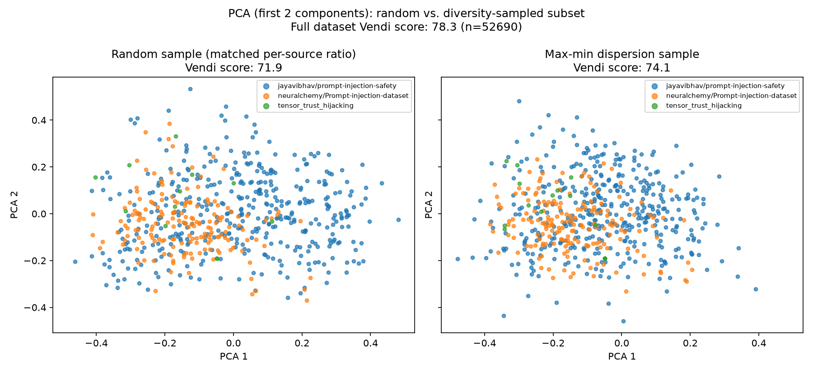

# Data

This folder contains scripts building a clean, held-out **evaluation set** for
benchmarking gatekeeper models, and a **training set** for fine-tuning one, as scoped in the repo's main Readme.

These scripts run a one time data curation job, but it is **not directly reproducible from a clean checkout**: building the evaluation set requires
[`deepset_relabeled.csv`](deepset_relabeled.csv), a manually relabeled copy of
`deepset/prompt-injections` (it has been relabled to align with the genreal interpretation of LLM01 used in this project), and building the training set requires
[`handcrafted_llm07.csv`](handcrafted_llm07.csv), 250 hand-authored LLM07 examples. These files can be obtained by contacting the author of the repo directly, everything else is either fetched from the Hugging Face Hub /
GitHub on demand, or derived from those two by the scripts described below.

## Data sources

### Target schema

Every source loader ([`helpers/dataset_loaders.py`](helpers/dataset_loaders.py)) normalizes the source into a common schema before anything is combined:

| field | type | meaning |
|---|---|---|
| `text` | str | raw user input to classify |
| `label` | int | gold label: `1` = LLM01/LLM07 threat, `0` = not a threat |
| `source` | str | dataset id |
| `threat_class` | str | `LLM01` \| `LLM07` \| `benign` \| `harmful_content` |

Harmful-content rows are retained with `label=0` (a pure harmful prompt with no injection *should*
get classifier output `0`) — they're tagged `threat_class=harmful_content` for audit, but otherwise
scored as ordinary negatives like any other `label=0` row. `LLM07` and `LLM01` are not mutually
exclusive in the source datasets — slices are labeled with their most representative category.

Deduplication is exact-match on the (lowercased, whitespace-collapsed) `text` field, applied once across all sources combined, before the evaluation/training partition.

### Sources

| Threat | Source | Notes |
|---|---|---|
| LLM01 | Tensor Trust hijacking (775 rows) | fetched directly from GitHub raw — training pool |
| LLM01 / benign / harmful_content | `jayavibhav/prompt-injection-safety` | 3-way label, harmful_content folded into `label=0` — training pool |
| LLM01 / benign | `neuralchemy/Prompt-injection-dataset` (`core` config) | `direct_injection` + benign-mapped categories; category whitelist per spec — training pool |
| LLM01 / LLM07 | `neuralchemy/Prompt-injection-dataset:clean` | 9 LLM01 + 2 LLM07 categories split out of the frame above — evaluation set |
| LLM07 | Tensor Trust extraction (569 rows) | fetched directly from GitHub raw, no manual download needed — evaluation set |
| LLM07 | `Lakera/gandalf_ignore_instructions` | attack-only, no native negatives — evaluation set |
| benign | `leolee99/NotInject` | benign prompts loaded with injection trigger words — the key false-positive-rate probe — evaluation set |
| benign | `allenai/wildguardmix` (`wildguardtest`) | gated — requires `HF_TOKEN`; skipped gracefully otherwise — evaluation set |
| LLM01 / benign | `deepset/prompt-injections` | small, clean, bilingual — manually relabeled out-of-scope examples (`deepset_relabeled.csv` is the source of truth) — evaluation set |
| benign | `natolambert/xstest-v2-copy` | safe split only — legitimate prompts that *sound* risky — evaluation set |

Notes on individual sources:

- **Tensor Trust** (hijacking + extraction) small human-generated files where every row is an attack,
  manually cleaned JSONL benchmarks published at
  [HumanCompatibleAI/tensor-trust-data](https://github.com/HumanCompatibleAI/tensor-trust-data).
- **`jayavibhav/prompt-injection-safety`** the largest source (~92% of
  `train_raw.parquet`) manual inspection shows that most rows are heavily-stylized, LLM-generated synthetic prompts with repetitive templates and narrow attack semantics: mostly "ignore previous
  instructions" / "start over" / "reveal your secret" variants. The
  benign/injection boundary is also inconsistent sometimes: similar phrasing
  ends up on both sides of the label.
- **`neuralchemy/Prompt-injection-dataset`** we use the `core` config only (a `full`
  config exists, it contains `core` plus paraphrase-augmented positives).
  The `category` field is filtered: `benign`/`control`/`crescendo`/`edge_case` are labeled as `benign`.
  Categories `agent_manipulation`, `code_execution`, `context_confusion`, `indirect_injection`,
  `instruction_override`, `output_manipulation`, `prompt_injection`, `rag_poisoning`,
  `token_smuggling` plus `prompt_extraction`/`system_extraction` are labeled `threat` and used as
  the clean, evaluation slice (`neuralchemy/Prompt-injection-dataset:clean`)
  The `direct_injection` category is also labeled as `threat` but kept for
  the training pool. The other categories are dropped based on manual inspection.
- **`Lakera/gandalf_ignore_instructions`** Every row is an attack on
  Gandalf's hidden password/system prompt`.
- **`leolee99/NotInject`** (339 rows) begnign prompts containing injection trigger words
  ("ignore", "system", etc.). This is a valuable negative examples source.
- **`allenai/wildguardmix`** (`wildguardtest` config) Filtered to
  `prompt_harm_label == "unharmful"` (gated on HF, requires token based auth)
- **`deepset/prompt-injections`** Actually loaded from `deepset_relabeled.csv` in this folder.
- **`natolambert/xstest-v2-copy`** benign questions that sound risky ("how do I
  kill a process?"). Only the `prompts` split is used.

## Scripts

Three `main_*.py` scripts act as entrypoints for the dataset building pipeline and are meant to be run in the following order:

1. [`main_create_datasets.py`](main_create_datasets.py):  pulls every source, normalizes,
   deduplicates and partitions the result into `eval_dataset_clean.parquet`
   and `train_raw.parquet`.
2. [`main_distill_train_set.py`](main_distill_train_set.py): reads `train_raw.parquet` and distills a live gatekeeper's knowledge into it by keeping only examples for which a threat has been detected, and produces `train_distilled.parquet`. This requires that a live gatekeeper instance is running, with a good enough model for distillation.
3. [`main_train_set_consolidation.py`](main_train_set_consolidation.py): reads
   `train_distilled.parquet`, deduplicates, the result, appiles diversity preserving sampling, appends the handcrafted LLM07 rows and
   produces the final fine tuning dataset; `train_consolidated.parquet`

## Evaluation set

`eval_dataset_clean.parquet`: this is built from the most-audited sources or slices and is the cleanest, most diverse set. It is held out
entirely from any training pool and used as-is for model evaluation: Tensor Trust extraction,
`deepset/prompt-injections`, `leolee99/NotInject`, `natolambert/xstest-v2-copy`,
`Lakera/gandalf_ignore_instructions`, `allenai/wildguardmix`, and the `:clean` slice of
`neuralchemy/Prompt-injection-dataset`.

This is the file `evaluation/evaluation.py` scores models against.

**Stats** 

| | |
|---|---|
| Rows | 3,664 |
| Sources | 7 |
| `label=1` rate | 49.4% |

| `threat_class` | rows | `label=1` |
|---|---|---|
| LLM01 | 440 | 348 |
| LLM07 | 1,463 | 1,463 |
| benign | 1,761 | 0 |

## Training set

`train_raw.parquet` can't be fine-tuned on directly. It's dominated (~92%) by
`jayavibhav/prompt-injection-safety`, whose labels are noisy in places and whose attack patterns are
semantically narrow. Training directly on it risks overfitting, so we apply distillation
using the best zero-shot classifier and diversity sampling. Distillation should reduce label noise, and diversity sampling reduce the train set size while preserving the most diverse examples, which should attenuate the risk of overfitting.

`train_consolidated.parquet` is the final fine-tuning set. Here is the data flow bilding this training set:

```
train_raw.parquet (64,247 rows)
  │  main_distill_train_set.py — zero-shot distillation
  ▼
train_distilled.parquet (52,786 rows)
  │  main_train_set_consolidation.py:
  │    1. near-duplicate removal
  ▼
  ~52,690 rows
  │    2. diversity sampling (per source × label)
  ▼
  ~10,580 rows
  │    3. + handcrafted_llm07.csv (250 rows)
  ▼
train_consolidated.parquet (10,830 rows)
```

1. **Distillation**: Every `label=1` row is sent through a live gatekeeper
   `/verify` endpoint serving the best model so far. Rows that the model doesn't flag as threats are considered label noise and dropped from the training set. The gatekeeper model used is the **best-performing 9B model** and its matching prompt
   (`app/verification/prompts/default-9b.yaml`)

2. **Near-duplicate removal** ([`helpers/near_duplicates.py`](helpers/near_duplicates.py)) Near duplicates are eliminated by computing the Jaccard similarity using minhashing. The Jaccard similarity threshold is set at 0.8.

3. **Diversity sampling** ([`helpers/diversity_sampling.py`](helpers/diversity_sampling.py)) — In order to reduce the final training set size and limit the risk of repeating similar prompts/patters (beyond simple near-duplicate removal), we apply diversity maximizing sampling over the distilled set.

4. **Append handcrafted LLM07 examples**: `handcrafted_llm07.csv`, 250 hand-authored
   `label=1`/`LLM07` rows ar append. It has been manually created because the raw training set does not contain LLM07 threats examples

**Stats**:

| | |
|---|---|
| Rows | 10,830 |
| Sources | 4 |
| `label=1` rate | 43.9% |

| `threat_class` | rows | `label=1` |
|---|---|---|
| LLM01 | 4,502 | 4,502 |
| LLM07 | 250 | 250 |
| benign | 6,078 | 1 |

### Diversity sampling: farthest-point sampling (FPS)

Within each `(source, label)` group, rows are embedded
with `sentence-transformers/paraphrase-MiniLM-L3-v2`, L2-normalized and PCA-reduced to 100
dimensions, retaining ~81% of variance. The rows are then downsampled via greedy **farthest point sampling**, also known as max-min dispersion.

Sampling is stratified by `(source, label)` so that diversity is maximized within each class. The fraction kept is configured per source in `helpers/diversity_sampling.py`'s `SOURCE_SAMPLE_FRACTIONS`:

| source | fraction kept |
|---|---|
| `jayavibhav/prompt-injection-safety` | 15% |
| `neuralchemy/Prompt-injection-dataset` | 75% |
| `tensor_trust_hijacking` | 100% |

### Measuring the effect: Vendi score

To check FPS actually buys more effective diversity than plain random sampling, we compute the **Vendi score**
([Friedman & Dieng, 2022](https://arxiv.org/abs/2210.02410)) for three sets: the full pre-sampling
pool, a random sample matched to the same per-source sizes FPS kept, and the FPS-sampled set itself.



On the run above: the full pre-sampling pool (n=52,690) scores **78.3**, a random sample matched to
FPS's per-source proportions scores **71.9**, and the FPS-sampled set scores **74.1**. This confirms
that FPS keeps more effective diversity than random sampling would at the same size, though the gap is not huge. We can note that the diversity gap with the full dataset is not huge either (4 points of vendi score), although the cardinality has been reduced by a factor of ~5. Since the main downsampling factor comes from `jayavibhav/prompt-injection-safety`, this tends to confirm that this dataset contained redundant, repetitive patterns, as drastically reducing its contribution does not drastically reduce the measure of diversity.
